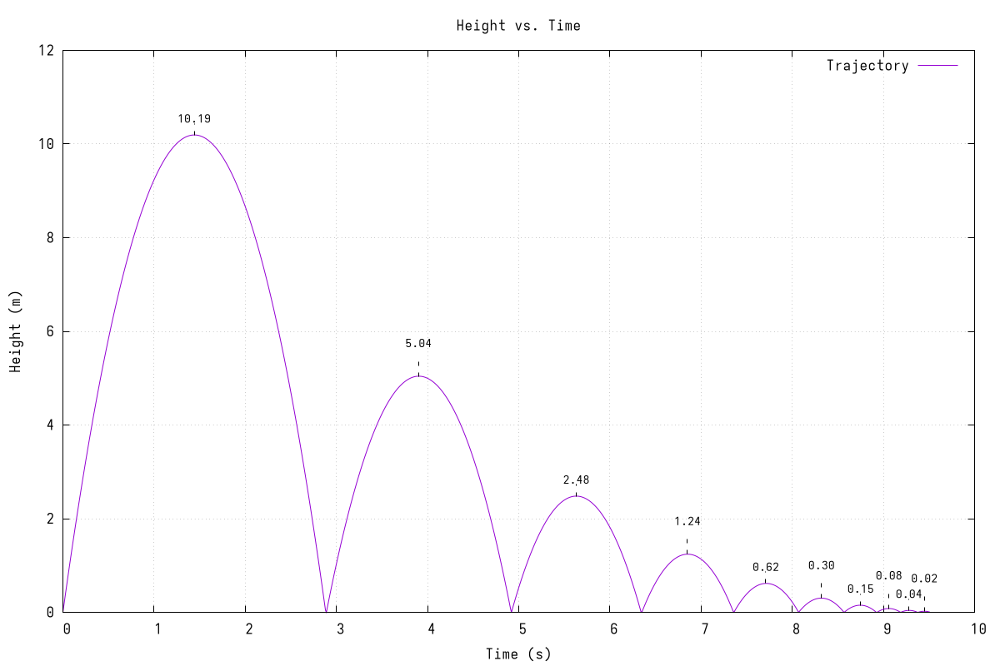

# Fortran 77 Bouncy Ball Sim
I decided to learn a bit of old school Fortran, I got inspired by some old F77 punch cards I got off eBay. \
The language is actually kinda nice, I like how simple it is.

`example_output.txt` is self-explanatory. \
There are to images, a PGM made from `BOUNCY.FOR`, and a gnuplot PNG. \
You can view the PGM online [here](https://bytes.usc.edu/~saty/tools/PGMViewer/viewer.html).

### GNUPlot PNG

